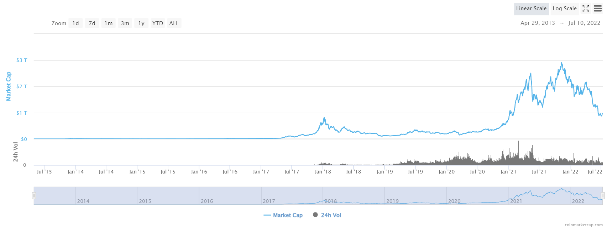

#  &nbsp; A Look at Avalanche &nbsp; &nbsp; &nbsp; &nbsp; &nbsp; &nbsp; &nbsp; &nbsp; &nbsp; &nbsp; &nbsp; &nbsp; &nbsp; &nbsp; &nbsp; &nbsp; &nbsp; &nbsp; &nbsp; &nbsp; &nbsp; Tim Lukes
## Overview and Origin

* Name of company
  * Ava Labs
* When was the company incorporated?
  * 05/07/2020
* Who are the founders of the company?
  * Emin Gun Sirer, Kevin Sekniqi, Ted Yin
* How did the idea for the company (or project) come about?
  * Blockchains at the time had slow transaction times and limited scalability. AVAX believes it can offer solutions both problems with their consensus protocal.
* How is the company funded? How much funding have they received?
  * Ava Labs has raisded $290.1M over 7 rounds of funding.

## Business Activities:

Avalanche is a smart contract Blockchain that is an up and coming competitor to Ethereum. A couple problems that Ethereum has that Avalanche has claimed to solve are slow transaction times and lower gas fees with superior scalability. The scalability is solved by what Avalanche calls subnets, a subnet can be an entire blockchain that is validated by a subset of Avalanch nodes, subnets run parralel to the main blockchain so they ease the flow of traffic on the main chain, thus more users running smoothly in total. Subnets are fully independent of the main chain and thus can have their own custom rules which gives it a huge advantage for servicing multiple industries that require custom rules for regulation reasons.

Avalanche oporates on a Proof-of-Stake consensus algorithm where Ethereum runs Proof-of-Work. Proof-of-Work is very environmentally unfriendly as it requires "mining machines" running around the clock to work as validator nodes. Avalanche and their revolutionary "consensus protocol" uses proof of stake, where a fixed amount of AVAX needs to be staked to run a validator node. This greatly reduces the power cost of running the blockchain. It is worth noting that Ethereum has been planning to switch to Proof-of-Stake with their ETH 2.0 blockchain upgrade which is due to land this summer, although it has been pushed back many times previously. 

## Landscape:

The landscape for L1 Blockchains is expanding rapidly, but the top players are still the oldest chains. The most straight forward way to estimate the relative size of L1s is the market cap of the governing token, which is usually named after the chain. With a Market Cap of $397B the OG blockchain Bitcoin rules the roost. Next up is Ethereum with a MCAP of $141B. The MCAPs shrink rapidly after that; Binance Smart Chain $38B, Cardano $15B, Solana $13B, Avalanche $5B, Polygon $4.5M, Algorand $2M.

As of this writing the crypto market is in a major correction, but there are reasons to be optomistic about the future. The key is mass adoption, and although the market cap is currently in freefall (See image [1] below), the number of crypto users is growing, and however fun it is to watch big numbers go up, the fact that more people are dipping their toes in to crypto and becoming familiar with these platforms is all that matters in the long run.

[1] - *Coin Market Cap Global Cryptocurrency Charts*

[2] - *Coin Telegraph US Cryptocurrency Owners 2019 - 2023 prediction*

## Results

There is no doubt that Avalanch is at least partially responsible for some changes in the blockchain space, for instance Ethereums adoption of proof of stake rolling out soon. However there is still a lot that needs to play out in this space to even determine results, but Avalanche is making sure they are positioned well for the future. One of the major marketing levels Avalanche has is their "Avalanche Rush" program. Avalanche invested $225M into developers and marketing for the chain and crypto users came running, so much so that in an interveiw with forbes founder and CEO of Avalanche Emin stated: 

"So the value we had set aside, the amount in dollar terms, ballooned from $220 million, or whatever that was, to really large numbers, because we went up substantially after the Rush program came into effect. Of the coins we set aside, we've used only a fraction. So we are, I think, maybe 1/3 in of the coins." [3] - *Forbes, Emin Gun Sirer, Founder of the AValanche Blockchain, Is Not Sweating a 76% Drop in Token Price*

This is very exciting news for investors in the Avalanche Ecosystem because nothing has the drawing power of traffic like free money, and Avalanche has plenty more to give for now, and as of the writing of this paper a NFT Rush Program is underway, and NFTs are quickly becomming reguarded as one of the best avenues to get new consumers into crypto.

## Recommendations

My intrest in AVAX is in the fact that it was built from the ground up as a business, they have intelligent people all public in intelligent positions with clear intentions, they are building the next inferstructure for business to oporate on and they have a solution to scale to that level, they are ready and were built to comply with regulations as they are put into place, that alone eliminates a lot of the competition in the space. 

My recommendation for Avalanche is to keep focusing on building internally, and acessability trumps everything else. One of the emerging draws of blockchain tech is gaming with player owned digital assets. This is good for growing the space but very complicated to a normal user trying to keep track of gains and losses, even more so around tax season. The chain that can keeps making it eaier to nativly track sales of both tokens and NFTs, real time gains and loses comprable to local currency, and have auto tax filing to popular tax services will win the consumer race. 

#
**Sources:**

[1] - https://coinmarketcap.com/charts/

[2] - https://cointelegraph.com/news/3-6m-americans-to-use-crypto-to-make-a-purchase-in-2022-research-firm-predicts

[3] - https://www.forbes.com/sites/shehanchandrasekera/2022/05/31/emin-gun-sirer-founder-of-the-avalanche-blockchain-is-not-sweating-a-76-drop-in-token-price/?sh=d139c571e9a1

[4] - https://www.securities.io/avalanche-avax-vs-ethereum-eth-everything-you-need-to-know/

[5] - https://corpgov.law.harvard.edu/2021/01/14/defi-and-the-future-of-finance/

[6] - https://www.coindesk.com/learn/what-is-avalanche-a-look-at-the-popular-ethereum-killer-blockchain/

[7] - https://assets.website-files.com/5d80307810123f5ffbb34d6e/6008d7bbf8b10d1eb01e7e16_Avalanche%20Platform%20Whitepaper.pdf

[8] - https://www.crunchbase.com/organization/ava-labs/investor_financials

[9] - https://sec.report/Document/0001789243-20-000002/